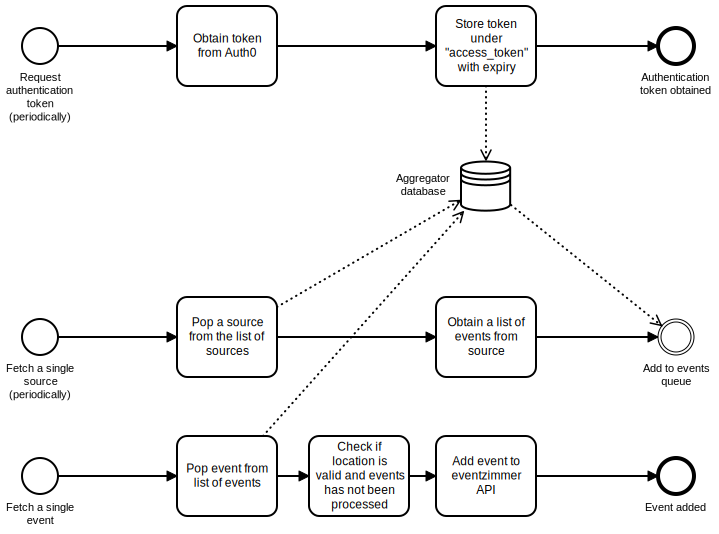

eventzimmer aggregator
----------------------

# Overview

Aggregator is an aggregation server on top of the [bull](https://github.com/OptimalBits/bull) library.

A high level overview of the queues can be found in the diagram below:

To aggregate info we use [puppeteer](https://github.com/GoogleChrome/puppeteer) and [request](https://github.com/request/request).

### Configuration

Using below environment variables `aggregator` can be configured:

| environment variable | description                                           | default                                            |
|----------------------|-------------------------------------------------------|----------------------------------------------------|
| REDIS_URL            | Where to find redis                                   | redis://localhost:6379/1                           |
| ENDPOINT_URL         | Where to find the eventzimmer API                     | http://localhost:3000                           |
| CLIENT_ID            | The client ID to use for JWT auth                     | -                                                  |
| CLIENT_SECRET        | The client secret to use for JWT auth                 | -                                                  |
| HTTP_PROXY           | Whether to use a http proxy for Facebook aggregation  | -                                                  |
| HTTPS_PROXY          | Whether to use a https proxy for Facebook aggregation | -                                                  |
