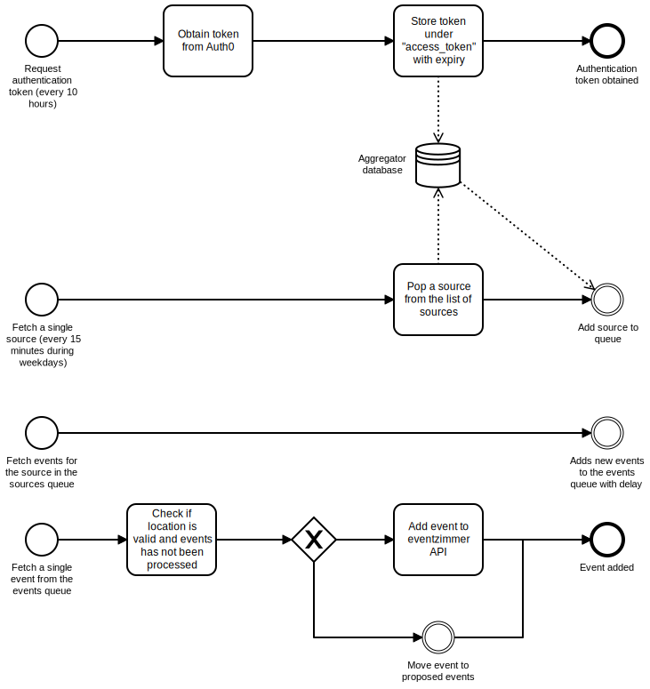

eventzimmer aggregator
----------------------

# Overview

Aggregator is an aggregation server on top of the [bull](https://github.com/OptimalBits/bull) library.

A high level overview of the queues can be found in the diagram below:

To aggregate info we use [puppeteer](https://github.com/GoogleChrome/puppeteer) and [request](https://github.com/request/request).
